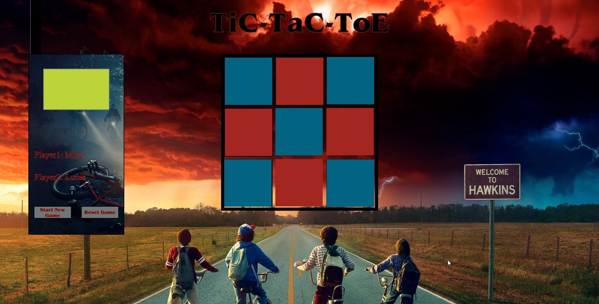

# _Stranger Things Tic-Tac-Toe_

## Description:  
This was my first project using HTML, CSS, and Javascript. I was tasked at designing a Tic-Tac-Toe game from scratch, that two local players could have fun with. The requirements stated were as follows:

> ###### Your Tic Tac Toe app must:
>
>* Render a game board in the browser  
>* Switch turns between X and O (or whichever markers you select)
>* Visually display which side won if a player gets three in a row, or show a draw if neither player wins
>* Include separate HTML / CSS / JavaScript files
>* Stick with KISS (Keep It Simple Stupid) and DRY (Don't Repeat Yourself) principles
>* Use JavaScript for DOM manipulation
>* Deploy your game online, where the rest of the world can access it
>* You can use GitHub Pages for deploying your project
>* Use semantic markup for HTML and CSS (adhere to best practices)
>* Have well-formatted, and well-commented code

## Getting Started:
This is a simple browser based game that can be accessed through this link: [Strange-Tic-Tac-Toe](https://jaypad07.github.io/Strange-Tic-Tac-Toe/)

## Technology/Tools used:
* [Git Bash](https://gitforwindows.org/) - to traverse the file system, execute system functions, and to interact with my GitHub repository.
* [WireFrame.cc](https://wireframe.cc/) - design and build conceptions of front-end design.
* [Visual Studio Code](https://code.visualstudio.com/) - to write code in Html, CSS, and Java Script.
* [ShareX](https://getsharex.com/downloads) - image capture program to take preview snapshots for this Readme.doc.
* [Mastery.games](https://mastery.games/) - FlexBox Zombies and Grid Critters, were a huge help in enhancing my CSS skills, as well as the many great articles there.
* [Developer.mozilla.org](https://developer.mozilla.org/en-US/docs/Web/JavaScript) - read many documents to increase my knowledge of Java Script functions.
* [Developer.Chrome.com](https://developer.chrome.com/docs/devtools/) - used to learn chrome devtools, this was of great help!
* [AlphaCoders.com](https://alphacoders.com/) obtained all wallpaper desgins here. Artists and those that discovered/uploaded will be credited in their own section below.
* [Archive.org](https://archive.org/) obtained Stranger Things mp3 audio file here.

## Design & Implementation Process 

1. Sketch a small design of product.
2. Design a wireframe.
3. Create a 3x3 grid with divs for Tic-Tac-Toe board.
4. Find a way to use Grid CSS and Flexbox to organize elements correctly.
5. Added small CSS design to elements to make sure they were displaying correctly.
6. Contemplate and create a win logic.
7. Created a 3x3 array to determine ownership of box.
8. Created a players class and board class to represent players and gameboard.
9. Create inner element to display X / O symbols.
10. Created a function that used eventListeners to allow player to click on elements to display their symbol.
12. Outline and revise needed methods.
13. Disabled all clicks when a player wins.
14. Designed a walkie-talkie using html/css that shows player turns as well as start/reset buttons.
15. Many more design implementations...

## MVP Stages (Minimum Viable Product)

### Bronze:

* Created a visual display of a Tic-Tac-Toe board.
* Add function to add new players.
* Add function to remove old players.
* Ability to display player names.
* Add function that sets the board by adding an eventListener to each div.
* Create two different functions for player symbols X / O.
* Create working start new game and reset buttons.
* Add a function that handles logic to determine a winner.
* Create function to switch players and count player turns.
* Add ability to assign player values to tiles clicked.
* Board should a display a winner

### Silver:

* 80's Theme? Think of Stranger Things, Ninja Turtles, Arcade Games. Looks like it is on a Arcade screen
* Add Stranger Things music.
* Make Tic Tac Toe header, board, and walkie-talkie have a shadow / fog effect.
* Have tiles light up, show a shadow / fog effect.
* Add player turn indicator. Maybe yellow/green light on player one's side and a dark blue light for player 2's side.
* Add sound effects.
* Random Selection of who goes first.
* Add HI-SCORE: When the game is over boxes change to a black arcade screen, this will show Hi-Scores. Back-end keeps track of most consecutive wins, draws, wins, ties, & turns?
* *Help!* Display story of Eleven stuck in the Upside-Down, telepathically communicating/writing through the walkie-talkie on screen. *Radio crackles, it's Eleven. She's stuck in the upside down. Story continues about you needing to help her. Both players want to help and agree that the winner of a best of 5 tic-tac-toe game goes to the upside down world to rescue her while the other stays behind for help.* Use filereader to read from text file that contains story. Story will display letters at a reduced rate to symbolize weak connection. 

### Gold:

* Create an algorithm for a computer controlled opponent.
* Enhanced Tic-Tac-Toe? Create different rule set? Change rules to make game more strategic / exciting?
* Upside Down dimension: Screen goes black board flips 180 degree, screen comes off black, lightning/thunder sounds, you have a limited amount of time to click? Symbols become translucent?
* Use power-ups that are obtained from taking one of the 4 disadvantageous tiles . Power-up ideas, random swap, random enemy symbol destruction, etc. Vecna image is hidden on the board, if you hit him the screen goes black for a second, you hear him laugh, the board rotated and when it returns the pieces are invisible. You only get one click?
* Add animations.

## Stages of Development:

###### My scratch notes & wireframe concepts:

  
   
  
  
  
   

## Wall of Thanks!
* Obinna - Always kept me laughing with his jokes.
* Lorena - some style/color advise.
* Kevin - always there to answer questions.
* Jeff - I couldn't have done the blinking cursor code on the walkie-talkie screen without him. It's his creation and his help was invaluable. Thank you!! 

## Background Artists:
##### wall.alphacoders.com  
* Main background discovered by: AvengerVulcan
* Walkie-talkie background discovered By: TorinoGT

## Contribute:
Issue Tracker: [https://github.com/Jaypad07/Tic-Tac-Toe/issues](https://github.com/Jaypad07/Tic-Tac-Toe/issues)
